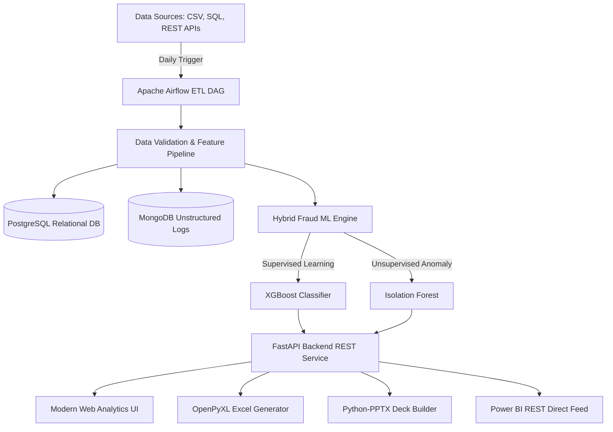

# System Architecture — FinSight AI Platform

The **FinSight AI** platform follows **Clean Architecture** principles, segregating data ingestion, feature transformation, machine learning inference, executive reporting, and API presentation layers.

---

## 1. High-Level System Architecture Diagram

---

## 2. Component Layer Specifications

1. **Ingestion & Data Engineering Layer (`src/services/etl.py`)**:
   - Handles multi-source data extraction (CSV, Excel, SQL, API).
   - Generates behavioral velocity features (`velocity_1h`, `velocity_24h`), customer amount z-scores, and geolocation distance deltas.

2. **Machine Learning & Risk Scoring Engine (`src/ml/`)**:
   - **XGBoost Classifier**: Predicts supervised fraud probability based on historical fraud labels.
   - **Isolation Forest**: Detects zero-day non-stationary financial anomalies without requiring labels.
   - **Explainable AI (SHAP)**: Identifies primary risk drivers for audit compliance.

3. **Backend API Presentation Layer (`src/api/`)**:
   - Built on **FastAPI** for high-performance async request handling.
   - OAuth2 Bearer JWT authentication and Role-Based Access Control (Admin, Analyst, Auditor).
   - Interactive OpenAPI Swagger interface served at `/docs`.

4. **Executive Reporting Engine (`src/reporting/`)**:
   - Programmatically builds styled `.xlsx` workbooks with custom palettes, formatted currency columns, and conditional risk highlights using `openpyxl`.
   - Generates 16:9 dark-themed C-suite presentation decks (`.pptx`) using `python-pptx`.
