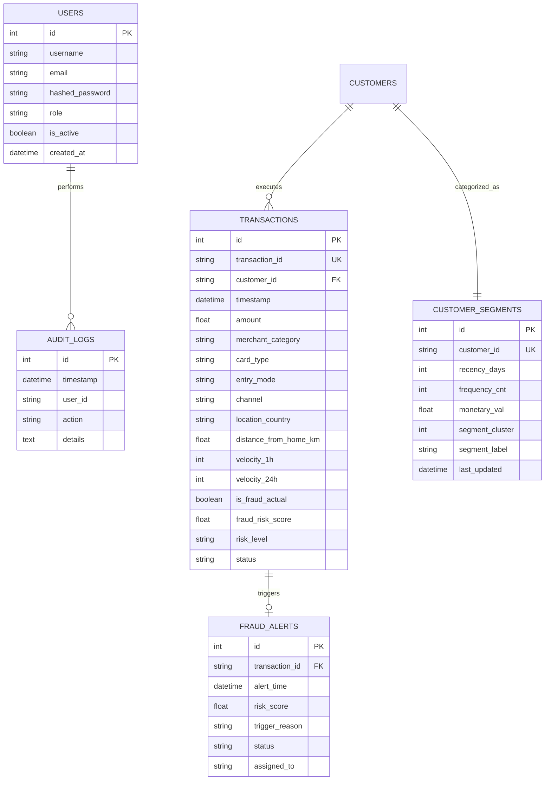

# Entity-Relationship (ER) Diagram — FinSight AI

The relational schema is optimized for high-throughput transaction indexing, customer RFM tracking, and real-time fraud alert triage.

---

## 1. Mermaid ER Diagram

---

## 2. Table Field Specifications

- **`transactions`**: Primary ledger table. B-Tree indexed on `transaction_id`, `customer_id`, `timestamp`, and `is_fraud_actual`.
- **`fraud_alerts`**: High-risk transaction queue for human analyst triage.
- **`customer_segments`**: Stores K-Means RFM clustering outputs updated via daily batch jobs.
